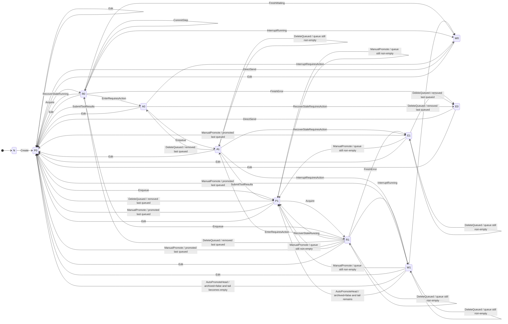

# chatd core chat state machine plan

## Status

Draft for review only. Do not start implementation until this plan is explicitly approved.

## Problem

`chatd` currently behaves like a state machine, but the actual execution path is
spread across direct SQL mutations, worker acquisition and heartbeats, pubsub,
in-memory fanout, relay behavior, and HTTP handlers that can race one another.

The goal of this plan is to replace that with a single **durable per-chat
command queue** and one **serialized command executor** per chat.

This file covers the **core chat state machine only**.

Two other state machines exist in the redesign:

- the **stream state machine**, which is responsible for snapshot assembly,
  incremental committed updates, relay tail attach, and resync behavior,
- the **ownership state machine**, which is responsible for owner lease retention,
  active stream pinning, and ownership lifetime.

Those two machines depend on the core machine's outputs, but they are not part
of the core chat semantics and are intentionally not specified in detail here.

## Scope

This machine owns all **durable chat semantics**:

- durable command ingestion,
- serialized command application,
- durable snapshot updates,
- committed message / queue / pending-action mutations,
- command result storage,
- retryable vs terminal command outcomes,
- recovery semantics.

This machine does **not** define:

- connected stream attach behavior,
- relay handshake details,
- owner retention / pinning policy.

It assumes one external runtime guarantee:

> next-command application is serialized per chat.

## Durable state

The core machine owns these durable structures:

- `chats`
  - `status`
  - `worker_id`
  - `heartbeat_at`
  - `run_epoch`
  - `last_applied_command_id`
  - `pending_action`
  - existing snapshot fields needed for prompt building and API responses
- `chat_commands`
  - durable pending queue of external and internal commands
- `chat_command_results`
  - short-lived processed results for synchronous waits and idempotent retries
- `chat_messages`
  - committed history
- `chat_queued_messages`
  - committed queue projection

## Command queue contract

`chat_commands` is a **durable pending-work queue**, not a permanent history log.
A command row exists only until it is conclusively processed.

Each command should include at least:

- `id BIGSERIAL`
- `chat_id`
- `kind`
- `payload JSONB`
- `source` (`external`, `effect`, `recovery`, `system`)
- `idempotency_key`
- `created_by`, `created_at`
- retry/backoff metadata needed while the command is still pending

## Command results and idempotency

Because processed commands are deleted from `chat_commands`, external waiters and
retries cannot rely on the command row itself as a durable result record.

Use `chat_command_results` for short-lived processed results.

Required fields:

- `command_id`
- `chat_id`
- `idempotency_key`
- `status`
- `result_payload`
- `error_payload`
- `created_at`
- `expires_at`

Rules:

- `idempotency_key` is required for external commands.
- Working assumption: results expire after **15 minutes**.
- `chat_command_results` is the source of truth for synchronous waiting.
- Pubsub may only be used as a wake-up hint that a result row may now exist.

## Snapshot contract

The core machine updates `chats` as the authoritative durable snapshot.

Critical fields:

- `run_epoch` fences stale long-running callbacks,
- `last_applied_command_id` is the durable watermark of committed state,
- `pending_action` is the authoritative `requires_action` payload.

`last_applied_command_id` answers:

> which committed state changes are included in this snapshot?

## Linearization point

Each applied command should linearize at one DB transaction that:

1. locks the chat snapshot row, or creates it for `CreateChat`,
2. verifies the current executor is allowed to apply the command,
3. reads the next pending command for the chat,
4. verifies it is the next expected command for the chat,
5. applies the transition to `chats`, `chat_messages`, queue projection, and
   `pending_action`,
6. advances `last_applied_command_id`,
7. appends any follow-up internal commands that become immediately runnable,
8. writes the short-lived success or error result to `chat_command_results` when
   needed for external waiters / idempotency,
9. deletes the processed command row from `chat_commands`.

## Outcome model

Every command must end in exactly one of three outcomes:

- **successfully processed**
- **terminally failed**
- **retryable failure**

### Successful processing

- commit durable state changes,
- write success row to `chat_command_results` if needed,
- delete the command row.

### Terminal failure

Use a dedicated **terminal-error type**.

If execution returns that type:

- treat the command as non-retryable,
- write error row to `chat_command_results` if needed,
- update chat snapshot appropriately,
- delete the command row.

### Retryable failure

If execution does **not** return the dedicated terminal-error type:

- treat it as retryable,
- leave the command pending,
- update retry/backoff metadata,
- retry up to **10 attempts**.

After the retry cap is reached:

- convert the outcome to terminal,
- write an error result,
- update the chat snapshot appropriately,
- delete the command row.

## Core state machine semantics

The full core machine must cover all durable chat transitions, including:

- create,
- direct send,
- enqueue,
- queued delete,
- queued promote,
- edit,
- start run,
- repeated step commit,
- interrupt,
- enter `requires_action`,
- submit tool results,
- auto-promote,
- archive / unarchive,
- stale recovery.

This plan does **not** reduce scope to a simplified subset. The full durable
chat semantics are the first implementation target.

## Abstract transition model

The following sections are integrated from the transition-successor analysis and
make the core chat state machine explicit at stable cut points.

## Important caveats

1. This document uses **refined stable state classes** so queue occupancy is
   explicit. A plain `status` alone is not enough to derive the successor set.
2. `Edit` is treated as available from every existing chat state because
   `Create(initialUser)` guarantees at least one user message exists.
3. `archived` only matters for `AutoPromoteHead`; that transition is allowed
   only when `archived = false`.
4. The abstract `ManualPromote(qid)` definition only requires `qid ∈ Q`, but if
   it is applied while `status = requires_action` it would leave
   `pendingCalls ≠ {}` while setting `status := pending`, which conflicts with
   invariant `I5`. Therefore this diagram **omits** `A1 -> ManualPromote` from
   the invariant-preserving graph and calls it out separately below as a model
   inconsistency that the redesign should resolve.
5. The current concrete cleanup path may combine run completion and queue
   follow-up at `CP4`. In the abstract graph below there is **no literal**
   `FinishWaiting -> AutoPromoteHead` edge, because `FinishWaiting` requires
   `Q = []` while `AutoPromoteHead` requires `Q ≠ []`.

## Transitions

### External transitions

- `Create(initialUser)` creates a new chat with its initial user turn and lands
  in `pending`.
- `DirectSend(m)` appends a user message directly to an idle chat and lands in
  `pending`.
- `Enqueue(m)` appends a user message to the durable queue without changing the
  active history.
- `ManualPromote(qid)` removes one queued message, appends it to history as a
  user turn, and lands in `pending`.
- `DeleteQueued(qid)` removes one queued message without changing the active
  history.
- `Edit(k, replacement)` truncates active history at a user turn, inserts the
  replacement turn, clears queue and pending calls, and lands in `pending`.
- `SubmitToolResults(results)` appends matching tool results, clears pending
  calls, and lands in `pending`.
- `InterruptRunning(optionalPartialStep)` stops a running chat, optionally
  persists one partial suffix, and lands in `waiting`.
- `InterruptRequiresAction(reason)` closes pending calls with synthetic error
  tool results and lands in `waiting`.

### Worker transitions

- `Acquire(w)` claims a `pending` chat for worker `w` and moves it to
  `running`.
- `CommitStep(step)` appends one durable assistant/tool suffix while remaining
  `running`.
- `EnterRequiresAction(calls)` records pending dynamic tool calls and lands in
  `requires_action`.
- `FinishWaiting` completes a run with no backlog and lands in `waiting`.
- `AutoPromoteHead` promotes the queue head from `waiting` to `pending` when
  backlog exists and the chat is not archived.
- `FinishError(err)` ends a running chat in `error`.

### Recovery transitions

- `RecoverStaleRunning` returns a stale `running` chat to `pending`.
- `RecoverStaleRequiresAction(reason)` closes pending calls with synthetic error
  tool results and lands in `error`.

## Refined stable state classes

| Code | Meaning |
|---|---|
| `N` | chat does not exist |
| `W0` | `status=waiting`, `Q=[]` |
| `W1` | `status=waiting`, `Q≠[]` |
| `E0` | `status=error`, `Q=[]` |
| `E1` | `status=error`, `Q≠[]` |
| `P0` | `status=pending`, `Q=[]` |
| `P1` | `status=pending`, `Q≠[]` |
| `R0` | `status=running`, `Q=[]` |
| `R1` | `status=running`, `Q≠[]` |
| `A0` | `status=requires_action`, `Q=[]`, `pendingCalls≠{}` |
| `A1` | `status=requires_action`, `Q≠[]`, `pendingCalls≠{}` |

## Exhaustive refined state diagram

## Model inconsistency to resolve in the redesign

As written, `ManualPromote(qid)` only requires `qid ∈ Q`. That would make it
appear callable from `A1`.

But its listed effects are:

- remove `qid` from `Q`
- append `User(qid.content)` to `H`
- `status := pending`
- `worker := None`

It does **not** clear `pendingCalls`.

So if applied from `A1`, it would produce a state with:

- `status = pending`
- `pendingCalls ≠ {}`

which conflicts with invariant `I5` (`status = requires_action iff pendingCalls ≠ {}`).

The redesign should therefore do one of the following explicitly:

1. reject `PromoteQueued` while `status = requires_action`, or
2. redefine `ManualPromote` so it also clears/closes `pendingCalls`, or
3. give it a different command/effect meaning in the actor model.

## Composite-operation notes

### Busy interrupt

`SendMessage` with interrupt semantics is **not** a single abstract transition.
It is modeled as:

1. `Enqueue(m)`
2. best-effort `InterruptRunning(...)`

So when looking for successors, treat those as two separate steps.

### Run completion with queue follow-up

The concrete implementation may combine release and queue promotion in one
cleanup path at `CP4`.

The abstract graph in this document keeps:

- `FinishWaiting` for `running -> waiting` when `Q=[]`, and
- `AutoPromoteHead` for `waiting -> pending` when `Q≠[]` and `archived=false`.

That means there is no direct `FinishWaiting -> AutoPromoteHead` edge in the
refined invariant-preserving graph.

## Relationship to the stream state machine

The stream machine consumes:

- the durable snapshot,
- committed pubsub deltas emitted after command apply,
- owner-tail handshake data.

The core machine should expose what the stream machine needs, but should not
embed stream-state logic internally.

## Relationship to the ownership state machine

The ownership state machine decides:

- how long ownership is retained,
- when active viewers pin the owner,
- when ownership is released,
- when heavy working-set residency may be dropped.

The core machine should not embed that policy. It only assumes that command
application is serialized per chat.

## Implementation order for this machine

1. encode the durable chat semantics in tests,
2. implement `chat_commands` and `chat_command_results`,
3. implement serialized command apply,
4. implement full durable chat transitions,
5. implement terminal-vs-retryable outcome handling,
6. remove direct mutation paths that bypass command application.

## Verification

At minimum, tests for this machine should prove:

- commands are applied once and in queue order,
- no two executors apply commands concurrently for the same chat,
- queue transitions are lossless,
- interrupt semantics remain queue-first then best-effort stop,
- `pending_action` is authoritative for `requires_action`,
- stale callbacks are fenced by `run_epoch`,
- processed commands are deleted only after conclusive handling,
- external waiters observe `chat_command_results` correctly,
- retryable failures retry and terminal failures do not.

## Exhaustive TODO

- [ ] Lock the exact internal command taxonomy and payload schema.
- [ ] Add migration(s) for `chat_commands`.
- [ ] Add migration(s) for `chat_command_results`.
- [ ] Add `run_epoch` to `chats`.
- [ ] Add `last_applied_command_id` to `chats`.
- [ ] Add `pending_action` to `chats`.
- [ ] Add any additional owner-executor metadata needed on `chats`.
- [ ] Add SQL queries to enqueue commands.
- [ ] Add SQL queries to fetch the next pending command in queue order.
- [ ] Add SQL queries to delete a processed command in the apply transaction.
- [ ] Add SQL queries to store and read `chat_command_results` payloads.
- [ ] Add TTL cleanup for expired `chat_command_results` rows.
- [ ] Require `idempotency_key` for external commands.
- [ ] Enforce `(chat_id, idempotency_key)` dedupe semantics for external commands.
- [ ] Implement the linearization transaction for command apply.
- [ ] Advance `last_applied_command_id` on every committed command apply.
- [ ] Delete successfully processed commands immediately after apply.
- [ ] Delete terminally failed commands immediately after writing their result.
- [ ] Keep retryable commands pending with retry/backoff metadata.
- [ ] Cap retryable command failures at 10 attempts.
- [ ] Introduce a dedicated terminal-error type and use it as the only non-retryable execution signal.
- [ ] Route `CreateChat` through the command queue.
- [ ] Route `SendMessage` through the command queue.
- [ ] Route queued delete / promote through the command queue.
- [ ] Route `EditMessage` through the command queue.
- [ ] Route `Interrupt` through the command queue.
- [ ] Route `SubmitToolResults` through the command queue.
- [ ] Route archive / unarchive through the command queue.
- [ ] Route stale recovery through the command queue.
- [ ] Route `StartRun` through the command queue.
- [ ] Route repeated `RunStepCommitted` self-loops through the command queue.
- [ ] Route `RunInterrupted`, `RunFailed`, and `RunRequiresAction` through the command queue.
- [ ] Keep `chat_queued_messages` as an actor-owned projection.
- [ ] Make queue/history movement atomic with command apply.
- [ ] Make `pending_action` authoritative on migrated paths.
- [ ] Fence stale callbacks with `run_epoch`.
- [ ] Write `chat_command_results` rows for external waiters and idempotent retries.
- [ ] Add deterministic tests for queue-first interrupt semantics.
- [ ] Add deterministic tests for no-loss queue promotion.
- [ ] Add deterministic tests for exact `requires_action` closure behavior.
- [ ] Add deterministic tests for archive / unarchive semantics.
- [ ] Add deterministic tests for stale recovery behavior.
- [ ] Add deterministic tests for terminal vs retryable failure behavior.
- [ ] Add deterministic tests for processed-command deletion after conclusive handling.
- [ ] Add deterministic tests for `chat_command_results`-based waiting and dedupe.
- [ ] Remove direct SQL mutation paths that bypass the core command queue.
