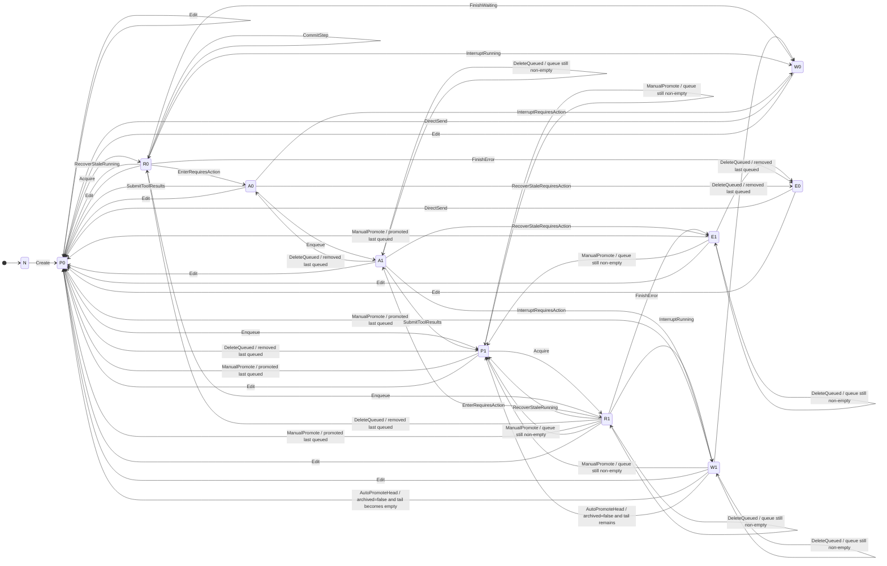

# chatd transition successor diagram

## Scope

This document makes the abstract transition system in
`chatd-loop-correctness-model.md` explicit.

It answers:

- what stable state classes exist at cut points,
- which transitions are allowed from each state class, and
- therefore which transitions can immediately follow which other transitions.

This is exhaustive with respect to the abstract transitions defined in the
model, using the model's stable cut points (`CP1..CP5`) and safety invariants.

## Important caveats

1. This document uses **refined stable state classes** so queue occupancy is
   explicit. A plain `status` alone is not enough to derive the successor set.
2. `Edit` is treated as available from every existing chat state because
   `Create(initialUser)` guarantees at least one user message exists.
3. `archived` only matters for `AutoPromoteHead`; that transition is allowed
   only when `archived = false`.
4. The abstract `ManualPromote(qid)` definition only requires `qid ∈ Q`, but if
   it is applied while `status = requires_action` it would leave
   `pendingCalls ≠ {}` while setting `status := pending`, which conflicts with
   invariant `I5`. Therefore this diagram **omits** `A1 -> ManualPromote` from
   the invariant-preserving graph and calls it out separately below as a model
   inconsistency that the redesign should resolve.
5. The current concrete cleanup path may combine run completion and queue
   follow-up at `CP4`. In the abstract graph below there is **no literal**
   `FinishWaiting -> AutoPromoteHead` edge, because `FinishWaiting` requires
   `Q = []` while `AutoPromoteHead` requires `Q ≠ []`.

## Transitions

### External transitions

- `Create(initialUser)` creates a new chat with its initial user turn and lands
  in `pending`.
- `DirectSend(m)` appends a user message directly to an idle chat and lands in
  `pending`.
- `Enqueue(m)` appends a user message to the durable queue without changing the
  active history.
- `ManualPromote(qid)` removes one queued message, appends it to history as a
  user turn, and lands in `pending`.
- `DeleteQueued(qid)` removes one queued message without changing the active
  history.
- `Edit(k, replacement)` truncates active history at a user turn, inserts the
  replacement turn, clears queue and pending calls, and lands in `pending`.
- `SubmitToolResults(results)` appends matching tool results, clears pending
  calls, and lands in `pending`.
- `InterruptRunning(optionalPartialStep)` stops a running chat, optionally
  persists one partial suffix, and lands in `waiting`.
- `InterruptRequiresAction(reason)` closes pending calls with synthetic error
  tool results and lands in `waiting`.

### Worker transitions

- `Acquire(w)` claims a `pending` chat for worker `w` and moves it to
  `running`.
- `CommitStep(step)` appends one durable assistant/tool suffix while remaining
  `running`.
- `EnterRequiresAction(calls)` records pending dynamic tool calls and lands in
  `requires_action`.
- `FinishWaiting` completes a run with no backlog and lands in `waiting`.
- `AutoPromoteHead` promotes the queue head from `waiting` to `pending` when
  backlog exists and the chat is not archived.
- `FinishError(err)` ends a running chat in `error`.

### Recovery transitions

- `RecoverStaleRunning` returns a stale `running` chat to `pending`.
- `RecoverStaleRequiresAction(reason)` closes pending calls with synthetic error
  tool results and lands in `error`.

## Refined stable state classes

| Code | Meaning |
|---|---|
| `N` | chat does not exist |
| `W0` | `status=waiting`, `Q=[]` |
| `W1` | `status=waiting`, `Q≠[]` |
| `E0` | `status=error`, `Q=[]` |
| `E1` | `status=error`, `Q≠[]` |
| `P0` | `status=pending`, `Q=[]` |
| `P1` | `status=pending`, `Q≠[]` |
| `R0` | `status=running`, `Q=[]` |
| `R1` | `status=running`, `Q≠[]` |
| `A0` | `status=requires_action`, `Q=[]`, `pendingCalls≠{}` |
| `A1` | `status=requires_action`, `Q≠[]`, `pendingCalls≠{}` |

## Exhaustive refined state diagram

## Model inconsistency to resolve in the redesign

As written, `ManualPromote(qid)` only requires `qid ∈ Q`. That would make it
appear callable from `A1`.

But its listed effects are:

- remove `qid` from `Q`
- append `User(qid.content)` to `H`
- `status := pending`
- `worker := None`

It does **not** clear `pendingCalls`.

So if applied from `A1`, it would produce a state with:

- `status = pending`
- `pendingCalls ≠ {}`

which conflicts with invariant `I5` (`status = requires_action iff pendingCalls ≠ {}`).

The redesign should therefore do one of the following explicitly:

1. reject `PromoteQueued` while `status = requires_action`, or
2. redefine `ManualPromote` so it also clears/closes `pendingCalls`, or
3. give it a different command/effect meaning in the actor model.

## Composite-operation notes

### Busy interrupt

`SendMessage` with interrupt semantics is **not** a single abstract transition.
It is modeled as:

1. `Enqueue(m)`
2. best-effort `InterruptRunning(...)`

So when looking for successors, treat those as two separate steps.

### Run completion with queue follow-up

The concrete implementation may combine release and queue promotion in one
cleanup path at `CP4`.

The abstract graph in this document keeps:

- `FinishWaiting` for `running -> waiting` when `Q=[]`, and
- `AutoPromoteHead` for `waiting -> pending` when `Q≠[]` and `archived=false`.

That means there is no direct `FinishWaiting -> AutoPromoteHead` edge in the
refined invariant-preserving graph.
